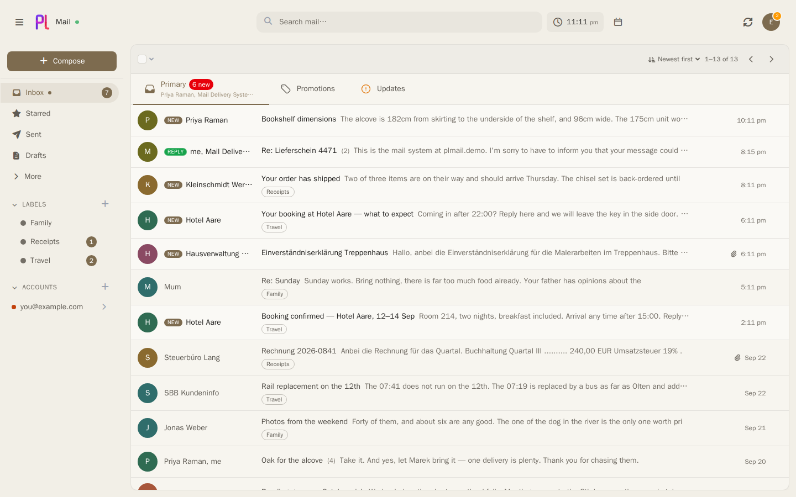
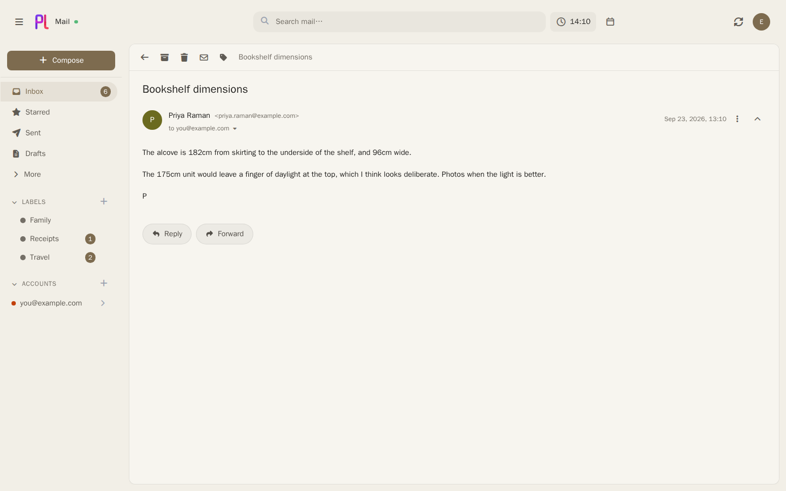
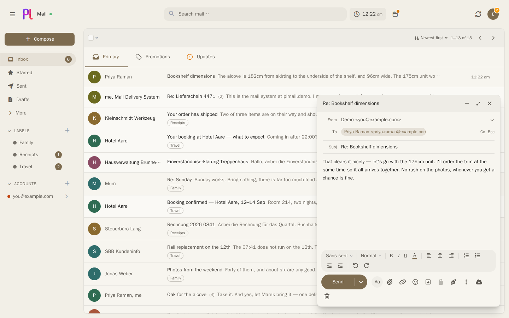
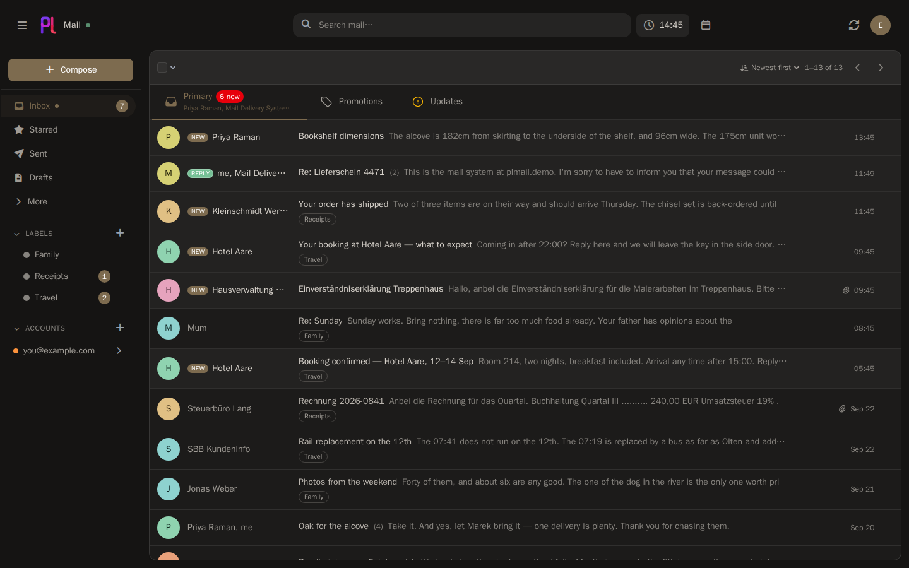
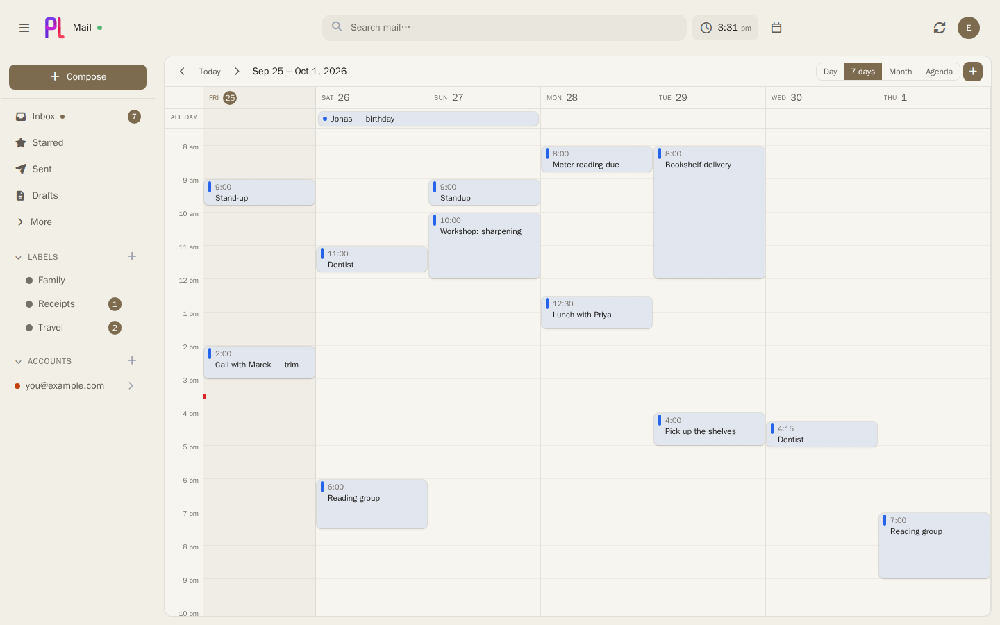
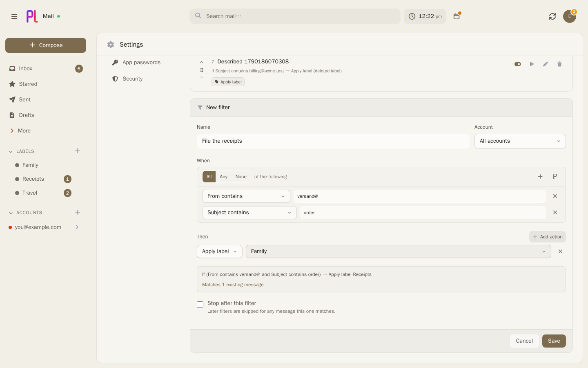
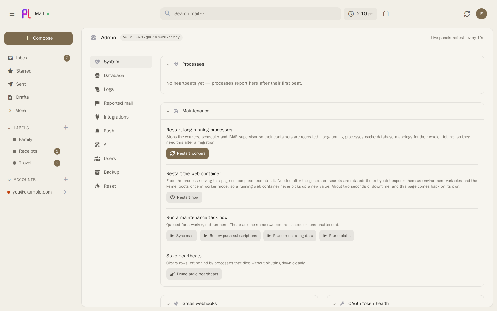

# plMail

Self-hosted mail with a calendar beside it. Connect the mailboxes you already have — IMAP, Gmail,
Outlook — and read them side by side in one inbox, on a server you own.


### 📖 [Read the handbook →](https://karatektus.github.io/pl_mail/docs/)

Installing on Docker, Linux, WSL2, macOS or a NAS · every feature in detail · connecting Gmail and
Outlook, with the exact permissions to tick · how the internals work.
Also on the [wiki](https://github.com/karatektus/pl_mail/wiki) and in [`docs/`](docs/) — all three
are built from the same files.

---

## What it is

A mail client you host yourself. It connects to the mailboxes you already have — IMAP, Gmail,
Outlook — syncs them into your own PostgreSQL database, and gives them one inbox, one search box and
one set of labels in the browser.

It is **not** a mail server: it doesn't receive mail from the internet or host your domain. Because
everything is synced locally, search runs against your database, and your mail stays readable when a
provider doesn't.



## Highlights

- **Every account in one place** — IMAP, Gmail and Outlook side by side, sending aliases included.
  Credentials are encrypted before they touch the database.
- **New mail arrives on its own** — IMAP IDLE, Gmail and Outlook push, browser notifications.
- **Search that means it** — full text plus `from:`, `subject:`, `label:`, `has:`, `before:` and
  friends, completed as you type.
- **Filters as a tree** — any/all/none, nested, restated in plain English and counted against real
  mail before you save. Apply one to mail that arrived before it existed.
- **A calendar beside the mail** — two-way sync with Google, Microsoft and CalDAV, drag-to-move
  week grid, invitations answered in place, share and booking links.
- **Files where you keep them** — attach from and save to Drive, Photos, OneDrive, Dropbox,
  Nextcloud and Immich.
- **A language model, if you want one** — point plMail at an Ollama box on your own network and it
  can search by meaning, draft replies, summarise a thread and sort mail into tabs. Off by default,
  each of the four switched on separately, and nothing ever leaves your network.
- **Yours** — two-factor auth, per-app JMAP passwords, 41 themes, English, German and Pirate.

## A look around

|  |  |
|---|---|
|  |  |
| **Threads** — replies collapse into one conversation. | **Compose** — rich text, autocomplete, undo send. |
|  |  |
| **Themes** — 41 of them, light and dark. | **Calendar** — docked beside the mail, or its own page. |
|  |  |
| **Filters** — counted before you save. | **Admin** — workers, push health, logs, queue. |

<sub>Screenshots use demo data — none of the accounts, senders or messages shown are real.</sub>

## Install

Images are published for `linux/amd64` and `linux/arm64`. Nothing to fill in first: the secrets are
generated on first start, and the public address is asked for on the setup screen.

### Docker

```bash
git clone https://github.com/karatektus/pl_mail.git
cd pl_mail
docker compose up -d
```

Open [https://localhost](https://localhost) and create your account.

### TrueNAS SCALE

1. Create a **dataset** for plMail — say `yourPool/yourDataSet/plmail`.
2. Open [`truenas.compose.yaml`](truenas.compose.yaml) and change one line to that path:
   ```yaml
   path_data: &path_data /mnt/yourPool/yourDataSet/plmail
   ```
3. **Apps → Discover → ⋮ → Install via YAML**, paste the file, install.

Reach it on port `30080` and put a reverse proxy in front of it. Everything else in that file works
as it is; each setting explains itself in place.

### Then

Add an IMAP mailbox in **Settings → Mail accounts** and you're done. Gmail and Outlook need OAuth
credentials from Google or Microsoft first — the handbook walks through both, including the
optional Pub/Sub topic for instant Gmail delivery.

> **Back up two things, separately:** the PostgreSQL data and `var/secrets/generated.env`. The
> database holds your mail; the key inside that file unlocks the credentials in it. Keeping them
> apart is the point — and losing the key means the stored mailbox passwords are gone.

## Contributing

Bug reports and pull requests welcome — see [CONTRIBUTING.md](CONTRIBUTING.md) for the dev setup,
the test suites and the console commands.

## License

AGPL-3.0.
