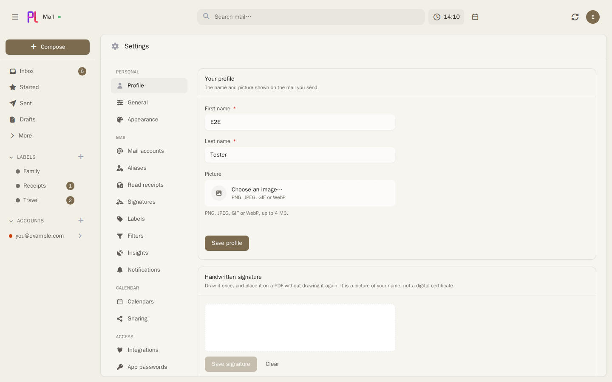

# Accounts and aliases

A plMail account is one mailbox you have somewhere else — an IMAP server, Gmail, or Outlook — that
plMail signs into and syncs. You can connect as many as you like; they sync independently and read
as one inbox.

Everything on this page lives under **Settings → Mail accounts**, except where it says otherwise.

## Adding an IMAP mailbox

**Settings → Mail accounts → Add account**, on the **IMAP / SMTP** tab. Enter the address and
password. The **Provider** dropdown carries the settings for a long list of common providers and is
matched against the domain you typed, so for most mailboxes the host, port and encryption fill
themselves in; several entries also carry a note about something the provider requires, such as
IMAP needing to be switched on in their web interface first. If yours is not listed, take the IMAP
and SMTP details from your provider's documentation.

A blank form starts on port 993 with SSL for incoming and port 587 with STARTTLS for outgoing,
which is what nearly every provider wants.

**Test connection** probes IMAP and SMTP separately and reports each. Saving does not depend on it,
but an account that stores cleanly and cannot log in is the failure worth catching now rather than
at the first sync, so the probe runs again on save and its outcome is remembered on the account.

The first sync starts immediately. After that, plMail holds an IMAP IDLE connection to each
mailbox and syncs the moment something changes, with a scheduled sweep every fifteen minutes
behind it.

See [IMAP and SMTP](../providers/imap-smtp.md) for the settings servers disagree about.

## Adding Gmail or Outlook

Both are OAuth, so an administrator has to register an application with the provider before the
button does anything. Once that is done, **Add account** offers **Continue with Google** and
**Continue with Microsoft** on the **OAuth** tab, and the whole flow is the provider's own consent
screen — no password is stored here at all.

Microsoft accounts go through Graph rather than IMAP. That is deliberate: Exchange Online treats
IMAP as legacy authentication and blocks it in any tenant running Security Defaults.

The registration itself — which console, which redirect URI, which scopes — is on
[Google](../providers/google.md) and [Microsoft](../providers/microsoft.md). Where the credentials
go is a choice: an administrator can enter them in **Admin → Integrations** under **Mail sign-in**,
or leave them in the environment as `GOOGLE_OAUTH_*` and `MICROSOFT_OAUTH_*`, which is what an
older installation will already be doing. See [Administration](admin.md).

An OAuth account has no editable form here. There is nothing to edit — no password, no host — so it
is managed by connecting and disconnecting rather than by a settings page.

## The account list

Accounts are listed in your own order and can be dragged to reorder. The order is not cosmetic: the
**first** account is the primary one, which is what a new compose window starts from. Removing an
account renumbers the rest, so the top row is always the primary.

Each row offers:

| Control | Effect |
|---|---|
| **Disable account** / **Enable account** | Stops or resumes syncing without deleting anything |
| **Edit account** | Server settings and password — password accounts only |
| **Remove account** | Deletes the account and every message synced from it |

Removing an account deletes its synced mail from plMail's database and nothing at the provider. It
also tries to tear down any push registration it had, so nothing is left pointing at an account
that no longer exists.

On the edit form, leaving the password field blank keeps the stored one.

## Per-account settings

Three controls sit under each account row. Each re-renders on its own rather than reloading the
whole list.

### Instant delivery

**Instant delivery** switches an account between push and scheduled polling. It appears only for
Gmail and Microsoft — a plain IMAP mailbox has no push manager, and IDLE already gives it the same
effect.

Turning it on registers with the provider there and then. If registration fails the switch goes
back off, so the interface never claims push is working while nothing is being delivered, and the
reason is spelled out:

- **Gmail** — Google refused the watch. Check that `GMAIL_PUBSUB_TOPIC` names a topic that exists
  and that the topic grants `gmail-api@system.gserviceaccount.com` the Pub/Sub Publisher role.
- **Microsoft** — Microsoft could not reach this server over HTTPS. Check the reverse proxy and
  `APP_PUBLIC_URL`.

Either way the account keeps syncing on a schedule. Push is an optimisation, never the only path.

The badge next to it reads **Push** when registrations are healthy, **Push (not delivering)** when
one is registered but nothing has arrived recently, and **Scheduled** when it is off. The middle
state usually means the Pub/Sub push subscription is missing or pointing somewhere else for Gmail,
or a lapsed subscription for Microsoft; **Re-register push** is the button for it.

Where push is not available on this server at all, the control says so rather than offering a
switch that cannot work.

### Sync labels to provider

Off by default. With it on, labels you create, rename or delete are mirrored to that provider,
whether the change came from the web UI or from a JMAP client.

Only Gmail and Microsoft offer it. On plain IMAP a label is a physical folder, so creating and
deleting labels would move real mail on the server — a different and riskier operation than the
switch promises.

It only ever affects changes made from now on. Labels that already exist are not pushed
retroactively, because that would mean bulk-creating your entire local tree at the provider from
one click.

### Messages to sync

How many of the newest messages a sync run may pull: **Sync everything**, or the newest 500, 1000,
2000, 5000, 10000 or 25000.

This exists for large mailboxes. Backfilling sixty thousand messages is hours of API calls before
the interface is useful, and the newest few thousand are what actually gets read. Older mail is not
queued for later — it is simply not fetched yet.

Raising or clearing the cap lets a **later** run walk further back; nothing is fetched at the moment
you change it. Lowering it deletes nothing. Raising it also clears the backfill cooldown, so you do
not sit out an hour left over from an earlier listing.

Not offered for Microsoft accounts. Graph enumerates a folder through a delta query whose cursor
only arrives after the final page, and the pages are not newest-first, so stopping early would give
neither a usable cursor nor the newest N. The setting is withheld rather than silently ignored.

## Sending aliases

**Settings → Aliases** lists the addresses each account sends and receives as. **Refresh from
provider** asks the account what it knows about; **Add** takes one you type yourself.

Each address is **Primary**, active, or disabled. The primary is the default sender for that
account and cannot be disabled or removed — make another one primary first, which demotes it.
Disabled addresses stay on the list and stop being offered in the compose window.

The **From** selector in the compose window lists accounts and aliases together, so sending as an
alias is one choice rather than two.

One caveat plMail states on the page itself: **Outlook sends as the account's primary alias
regardless of what you choose here.** That is Microsoft's behaviour, changed in your Microsoft
account settings, not here.

## Where to read further

- [IMAP and SMTP](../providers/imap-smtp.md), [Google](../providers/google.md),
  [Microsoft](../providers/microsoft.md) — the exact provider-side setup.
- [Mail ingest](../internals/mail-ingest.md) — what a sync run actually does.
- [Configuration reference](../install/configuration.md) — `APP_PUBLIC_URL`, the OAuth variables
  and the Pub/Sub ones.
- [Troubleshooting](../install/troubleshooting.md) — when mail stops arriving.

## Things that bite

**The first account in the list is the primary one.** Reordering by drag therefore changes which
account a new message is composed from. There is no separate "make primary" button, and none is
coming — the order is the setting.

**Lowering the sync cap does not free any space.** It bounds future runs only. Mail already synced
stays; `app:reset` is what re-fetches from scratch.

**Raising the cap does nothing visible until the next run.** Nothing is fetched at the moment you
change it, and on a large mailbox the next run has a lot of ground to make up.

**Testing the connection on an existing account needs a password in the field.** A blank password
means "keep the stored one" on the edit form, and the tester can only resolve that once the account
id has reached it — otherwise it says so rather than testing with nothing.

**Removing an account deletes its synced mail from plMail.** Nothing is removed at the provider,
and re-adding the account re-syncs it, subject to whatever sync window you then set.

**A Google consent screen lets the user untick calendar access while allowing mail.** The account
connects, mail works, and no calendars appear. Reconnecting with the box left ticked is the fix.

**Push failing is not an error state.** A self-hosted install may have no publicly reachable HTTPS
address at all. Registration failing means "stay on polling", and the fifteen-minute sweep is
unaffected.
